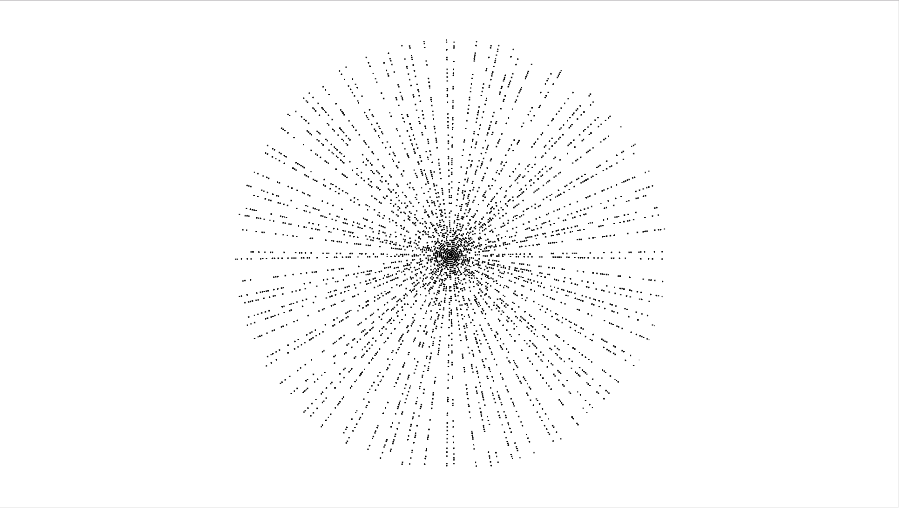
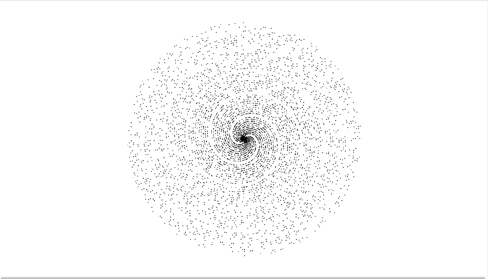

# Prime Spiral

Just a lazy Saturday morning playing around with Spirals.

```
1) Generate a Spiral of Points with an Index (starting at 1)
2) If that Index is a Prime Number, draw the point
```

## Screenshots


